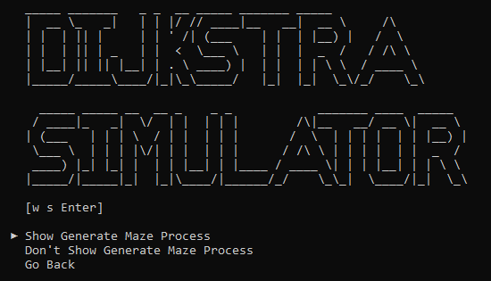
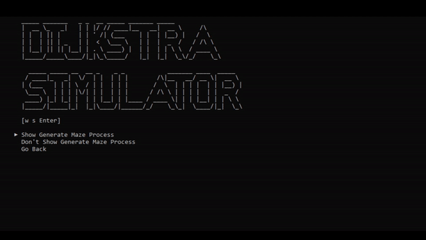

# Dijkstra-Simulator

(This is just me testing around print cursor. Sorry for the bad logic :D)

Home Screen
- This screen will be the first menu you see when you open the file.

From there, you can use wether you want to generate your maze perfectly (perfect maze) or not.

- Example of Perfect Maze:

- Example of Non-Perfect Maze:

After you choose what maze you want to generate, next you can decide wether you want to see the generating maze process or not.

- Example if you choose to show the generating maze process:

After that, you can choose wether you want to set the starting point and finish point yourself or randomize it
(*Note: starting point and finish point can't take the same place)

&ensp;&ensp;&ensp;&ensp;&ensp;&ensp;&ensp;&ensp;&ensp;&ensp;&ensp;&ensp;&ensp;&ensp;&ensp;&ensp;&ensp;&ensp;&ensp;&ensp;&ensp;&ensp;&ensp;&ensp;&ensp;&ensp;&ensp;&ensp;&ensp;&ensp;&ensp;&#8595

Then, you can choose wether you want to see the full process simulation of Dijkstra or just wanna see the best route.

- Example if you choose Full Process:

- Example if you choose Best Route:

